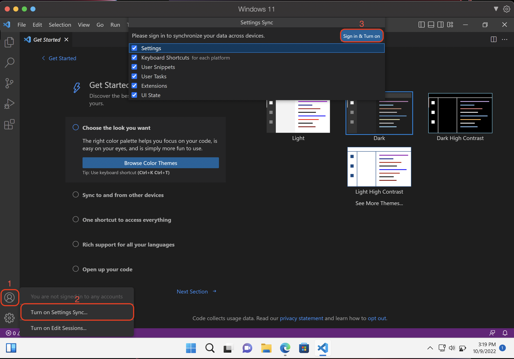
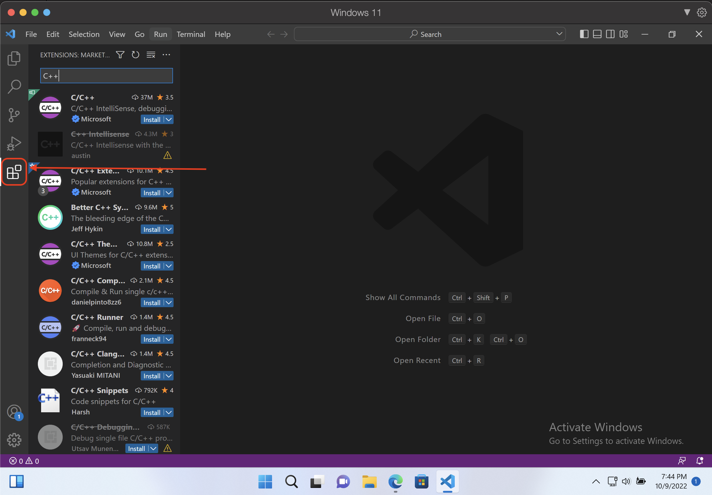
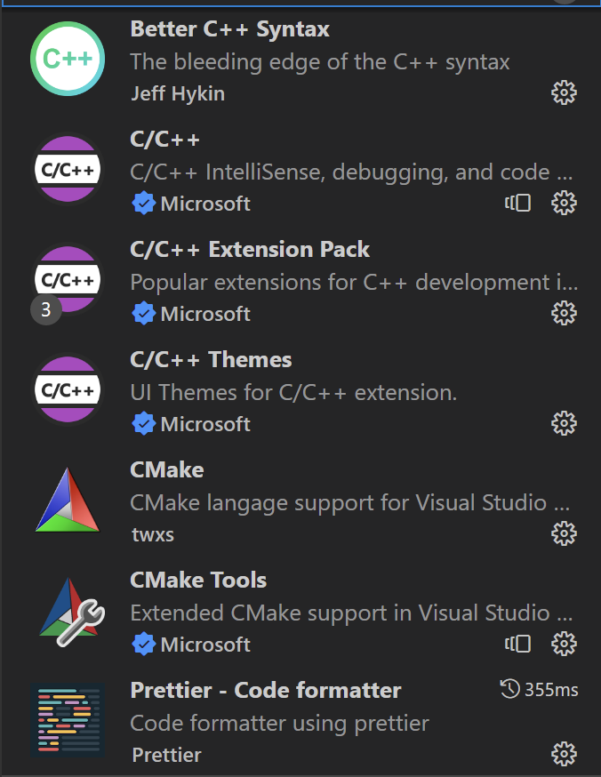

# A guide to installing VSCode and Git Bash on Windows
I have noticed several other students who want to use VSCode but have refrained from doing so because using it is difficult on Windows or because it is difficult to use while connected to the Hydra or Tesla machines.
This guide is intended for those people.

## Contents
Here are the sections to this guide:
1. Install [VSCode](https://code.visualstudio.com/Download)
2. Install [Git Bash]()
3. Set Git Bash as the default terminal in VSCode
4. Learn the basics of VSCode and some keyboard shortcuts
5. Learn how to quickly move files between your machine and the Hydra/Tesla machines

This guide will eventually be preceded/appended with a list of useful commands for quick reference.

### Installing VSCode

1. Visit [this link](https://code.visualstudio.com/Download) to download VSCode.
2. Download for your current Windows version (Accept license agreement, everything else default).
3. Now it's time to sign in.

Click the buttons in this order to sign in:

You will need to sign in using a GitHub account or a microsoft account.
I recommend using a GitHub account.

You can now set a color theme and customize your VSCode. I also highly recommend finding a font that you like and using that as your code font.

4. Before we go on to installing Git Bash, let's install the most important extensions for VSCode. 
I will just list the best ones to use for C++ here, since that is what we use at UTK.

Here's how: click the button in the red box in this image.

Here's the list you should install:

That's it setting up VSCode, unless you want to customize your font and font size, which you can do easily by using the `Ctrl + ,` shortcut, or by clicking the cog wheel in the bottom left corner and clicking **Settings**.

### Installing Git Bash

Git Bash is the terminal that we will be using and integrating into VSCode to emulate the unix environment. It's what will let us use unix commands as if we were on a unix machine. Useful so that you don't have to use PuTTy or MobaXTerm or whatever they're called.
Instead, you just get an integrated terminal.

1. Follow this link to [Git Bash](https://git-scm.com/downloads).
2. Click `Download For Windows 2.38.0` on the right side.
3. Download and run the installer.

Now for each section of this installer:

1. Select Components                 - default
2. Select Start Menu Folder          - default
3. Change default editor used by Git - Use Visual Studio Code as Git's default editor.
4. Adjusting name of initial branch  - Let Git decide (or switch to "main"). Just preference, doesn't affect anything.
5. Adjusting your PATH environment   - Use the recommended (2nd option)
6. Choosing HTTPS transport backend  - default (OpenSSL library)
7. Configure line ending conversions - Checkout as-is, commit Unix-style line endings.
8. Configure terminal emulator       - default (Use MinTTY)
9. Default behavior of `git pull`    - default
10. Credential helper                - default
11. Extra options                    - default
12. Experimental options             - none

Now Git Bash is installed.

### Setting Git Bash as default terminal in VSCode

Now, I would recommend always using Git Bash as your default terminal. It lets you use `ssh` and `scp` with the Hydra and Tesla machines, as well as letting you do everything else a standard unix terminal would do.

Let's set it as the default terminal in VSCode now.

1. If VSCode is open, close it.
2. Open VSCode
3. Use the keyboard shortcut `Ctrl + Shift + P`
4. Type in **"select default profile"**, and click **Enter**
5. Select "Git Bash" from the drop down menu (If you do not see Git Bash in the drop down menu, restart VSCode).

Now open a terminal in VSCode and try compiling a c++ file.

